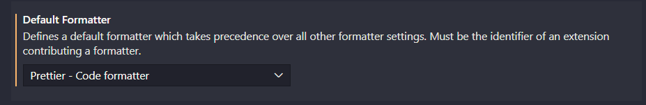
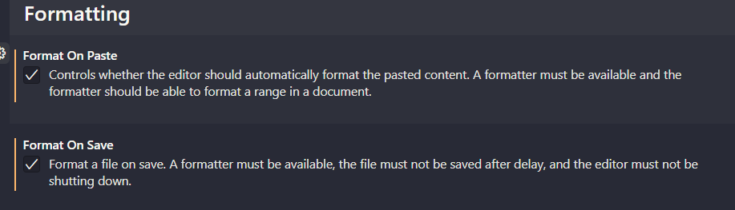
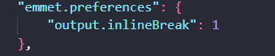

# VS-Config

## Recommended Extensions

- Live Server
- Dracula Official
- Prettier
- Material Icon Theme
- ES7+ React/Redux/React-Native snippets
- Git Lens
- Reactjs code snippets

## Settings (ctrl+,)

- User settings, set the default to Prettier

  

- User settings, set the format to on paste and save to on

  

- In the user JSON settings enter the following

  

## Configure Gitbash git-prompt.sh file

- Windows: c:/program files/git/etc/profile.d/git-prompt.sh

```shell
parse_git_branch() {
    git branch 2> /dev/null | sed -n -e 's/^\* \(.*\)/[\1]/p'
}
# COLOR_DEF='%f'
# COLOR_USR='%F{243}'
# COLOR_DIR='%F{197}'
# COLOR_GIT='%F{39}'
# NEWLINE=$'\n'
# # setopt PROMPT_SUBST
# export PROMPT='${COLOR_USR}%n@%M ${COLOR_DIR}%d ${COLOR_GIT}$(parse_git_branch)${COLOR_DEF}${NEWLINE}%% '
if test -f /etc/profile.d/git-sdk.sh
then
	TITLEPREFIX=SDK-${MSYSTEM#MINGW}
else
	TITLEPREFIX=$MSYSTEM
fi

if test -f ~/.config/git/git-prompt.sh
then
	. ~/.config/git/git-prompt.sh
else
	PS1='\[\033]0;$TITLEPREFIX:$PWD\007\]' # set window title
	PS1="$PS1"'\n'                 # new line
	PS1="$PS1"'\[\033[32m\]'       # change to green
	# PS1="$PS1"'\u@\h '             # user@host<space>
	PS1="$PS1"'\[\033[35m\]'       # change to purple
	# PS1="$PS1"'$MSYSTEM '          # show MSYSTEM
	# PS1="$PS1"'\[\033[33m\]'       # change to brownish yellow

	# PS1="$PS1"'\[\033[36m\]'       # change to cyan
	PS1="$PS1"'\e[38;5;10m'       # change to cyan 14
	PS1="$PS1"'`parse_git_branch`'' \e[38;5;11m'    # bash function
	# PS1="$PS1"'`parse_git_branch`'' \[\033[33m\]'    # bash function

	# PS1="$PS1"'`__git_ps1`'' \[\033[33m\]'    # bash function
	PS1="$PS1"'\W'                 # current working directory
	if test -z "$WINELOADERNOEXEC"
	then
		GIT_EXEC_PATH="$(git --exec-path 2>/dev/null)"
		# GIT_EXEC_PATH="$(git --exec-path 2>/dev/null)"
		COMPLETION_PATH="${GIT_EXEC_PATH%/libexec/git-core}"
		COMPLETION_PATH="${COMPLETION_PATH%/lib/git-core}"
		COMPLETION_PATH="$COMPLETION_PATH/share/git/completion"
		if test -f "$COMPLETION_PATH/git-prompt.sh"
		then
			. "$COMPLETION_PATH/git-completion.bash"
			. "$COMPLETION_PATH/git-prompt.sh"
			PS1="$PS1"'\[\033[33m\]'  # brownish yellow
			# PS1="$PS1"'\[\033[36m\]'  # change color to cyan
		fi
	fi
	PS1="$PS1"'\[\033[0m\]'        # change color
	# PS1="$PS1"'\n'                 # new line
	# PS1="$PS1"'$ '                 # prompt: always $

fi

MSYS2_PS1="$PS1"               # for detection by MSYS2 SDK's bash.basrc

# Evaluate all user-specific Bash completion scripts (if any)
if test -z "$WINELOADERNOEXEC"
then
	for c in "$HOME"/bash_completion.d/*.bash
	do
		# Handle absence of any scripts (or the folder) gracefully
		test ! -f "$c" ||
		. "$c"
	done
fi
```
